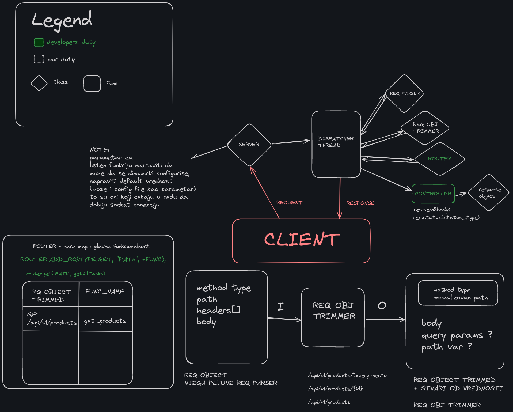

# C++ HTTP Framework

This project is a lightweight HTTP framework written in C++ designed for C++ projects. Our current roadmap includes the development of an HTTP 1.0 server, a router, and an easy way to populate the router with developer-defined controller functions.

## Table of Contents

- [Overview](#overview)
- [Features](#features)
- [Usage](#usage)
- [Roadmap](#roadmap)
- [Contributing](#contributing)
- [License](#license)

## Overview

This HTTP framework provides a foundation for building web servers in C++. It features a modular design that allows for easy integration and extension. The core components include a server, a dispatcher thread, a request parser, a request object trimmer, a router, and a controller. We aim to have Express.js-like syntax.



## Features

- **HTTP 1.0 Server**: Basic server implementation for handling HTTP 1.0 requests.
- **Router**: Efficient routing mechanism to map HTTP requests to appropriate handler functions.
- **Request Handling**: Comprehensive request parsing and object trimming for normalized handling.
- **Controller Integration**: Simplified method for developers to define and integrate controller functions.

## Usage

Here is a basic example of how to set up and use the HTTP framework:

1. **Initialize the server and router:**

```cpp
#include "server.h"
#include "router.h"

int main() {
    Server server;
    Router router;

    // Define controller function
    auto getProducts = [](const Request& req, Response& res) {
        // Your logic here
        res.send("Product list");
        res.status(200);
    };

    // Populate the router
    router.get("/api/v1/products", getProducts);

    // Start the server
    server.start(router);

    return 0;
}
```

2. **Defining a controller function:**

```cpp
void getProducts(const Request& req, Response& res) {
    // Implement your logic...
    res.status(200).send("Product list");
}
```

3. **Populate the router:**

```cpp
router.get("/api/products", getProducts);
```

## Roadmap

- **HTTP 1.1 and HTTP/2 Support**
- **Middleware Support**
- **Static File Serving**

## License

This project is licensed under the MIT License. See the [LICENSE](LICENSE) file for details.
