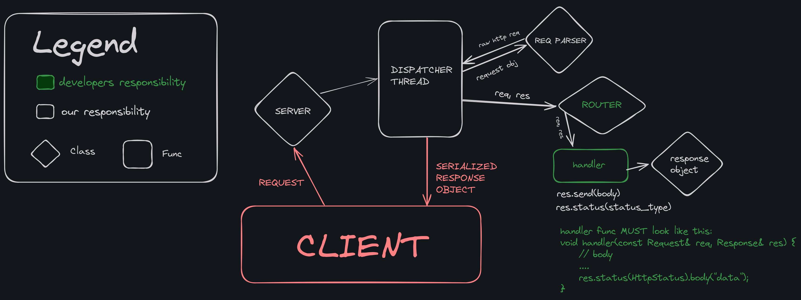

# Super-framework (WIP)

Super is a lightweight and expressive HTTP framework for C++ inspired by Express.js, designed to be simple, efficient, and flexible. The framework provides easy-to-use routing, a built-in web server, and a powerful response API.

## Table of Contents

- [Features](#features)
- [Example Usage](#example-usage)
- [Architecture](#framework-architecture)
- [Plans](#planned-features)
- [Getting started](#getting-started)
- [License](#license)

## Features

- **HTTP 1.0 Support**: The framework fully supports the HTTP 1.0 protocol, making it suitable for basic web applications.
- **Static File Serving**: Serve static files from a specified directory effortlessly.
- **Express.js-like Workflow**: The framework offers a familiar and straightforward workflow similar to Express.js.
- **Easy Routing Mechanisms**: Define routes and handle HTTP methods with a clean and simple interface.
- **Built-in Web Server**: The framework includes a built-in web server that uses blocking sockets with a timeout to manage connections.
- **Thread-per-Request Model**: Each request is handled in its own thread, ensuring that the server remains responsive even under load. (Note: we don't use thread pool yet, but will implement it in the future)
- **Simple Response API**: The response API is designed to be similar to Express.js, allowing you to send responses and set status codes with intuitive methods.
- **Query Parameter Support**: Easily access and manipulate query parameters in your routes.

## Example Usage

```cpp
#include "server.hpp"

#define port 5000

void hello_world(const Request& req, Response& res) {
    res.send("Hello, world from controller function!!").status(OK);
}

void init_router(Router& router) {
    router.route(HTTP_GET, "/controller", hello_world);
    router.serve_static("./public/");
}

int main() {
    Router router;
    init_router(router);

    Server server;
    server.start(port, router);

    return 0;
}
```

## Framework architecture

The architecture is designed to be modular and efficient. Below is an overview of the main components:

1. **Server**: Listens for incoming requests and delegates them to the dispatcher thread.
2. **Dispatcher Thread**: Is responsible for reading data from the socket, processing the request, and sending a response.
3. **Request Parser**: Parses the raw HTTP request and generates a request object.
4. **Router**: Routes the request to the appropriate controller based on the URL.
5. **Controller**: Handles the logic for the request and prepares the response object (This is you).
6. **Client**: Receives the serialized response object and processes the response.



The controller functions must adhere to the following signature:

```cpp
void controller(const Request& req, Response& res) {
    // body
}
```

## Planned Features

- **Route Parameters**: Support for dynamic route parameters (path variables in Spring Boot).
- **Thread Pool**: Implement a thread pool to handle requests more efficiently under high load.
- **HTTP 1.1 Support**: Add support for HTTP 1.1 to take advantage of persistent connections and other improvements.
- **Middleware Support**: Introduce middleware to allow for more modular and reusable code.

## Getting started

1. Clone the repository

```sh
git clone git@github.com:webstrugglers/super-frmwrk.git
cd super-frmwrk
```

2. Build the framework

```sh
make
```

3. Run

```sh
./superFrmwrk
```

## License

This project is licensed under the MIT License. See the [LICENSE](LICENSE) file for details.
